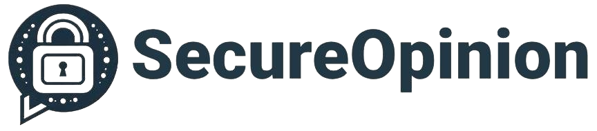
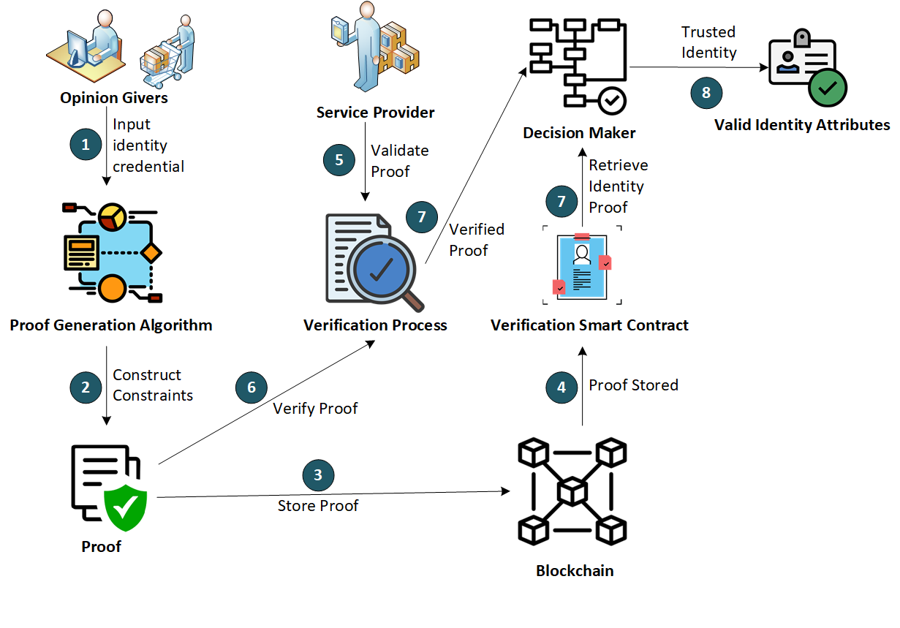

<div align="center">
  
  <p>
    We're building a user-centric, fully decentralised, secure, privacy-preserving, and openly accessible opinion sharing platform. 
  </p>  
<!-- Badges -->
<p>
  <a href="https://github.com/mhrehman17/SecureOpinion/graphs/contributors">
    
  </a>
  <a href="">
    
  </a>
  <a href="https://github.com/mhrehman17/SecureOpinion/network/members">
    
  </a>
  <a href="https://github.com/mhrehman17/SecureOpinion/stargazers">
    
  </a>
  <a href="https://github.com/mhrehman17/SecureOpinion/issues/">
    
  </a>
  <a href="https://github.com/mhrehman17/SecureOpinion/blob/master/LICENSE">
    
  </a>
</p>
   
<h4>
    <a href="https://github.com/mhrehman17/SecureOpinion/">View Demo</a>
  <span> · </span>
    <a href="https://github.com/mhrehman17/SecureOpinion">Documentation</a>
  <span> · </span>
    <a href="https://github.com/mhrehman17/SecureOpinion/issues/">Report Bug</a>
  <span> · </span>
    <a href="https://github.com/mhrehman17/SecureOpinion/issues/">Request Feature</a>
  </h4>
</div>

<br />

<!-- Table of Contents -->
# :notebook_with_decorative_cover: Table of Contents

- [About the Project](#star2-about-the-project)
  * [Screenshots](#camera-screenshots)
  * [Tech Stack](#space_invader-tech-stack)
  * [Features](#dart-features)
  * [Color Reference](#art-color-reference)
  * [Environment Variables](#key-environment-variables)
- [Getting Started](#toolbox-getting-started)
  * [Prerequisites](#bangbang-prerequisites)
  * [Installation](#gear-installation)
  * [Running Tests](#test_tube-running-tests)
  * [Run Locally](#running-run-locally)
  * [Deployment](#triangular_flag_on_post-deployment)
- [Usage](#eyes-usage)
- [Roadmap](#compass-roadmap)
- [Contributing](#wave-contributing)
  * [Code of Conduct](#scroll-code-of-conduct)
- [FAQ](#grey_question-faq)
- [License](#warning-license)
- [Contact](#handshake-contact)
- [Acknowledgements](#gem-acknowledgements)

  

<!-- About the Project -->
## :star2: About the Project

Societies run with law, tolerance, and harmony. Fake opinions create chaos, anarchy, polarisation, disturbance, and marginalisation in the socities. We're building a blockchain-based, user-centred, and privacy-preserving opinion sharing platform to increae trust and exercise responsible freedom of speech on the internet. Join this revolution.


<!-- Screenshots -->
### :camera: Overview 

<div align="center"> 
  
</div>


<!-- TechStack -->
### :space_invader: Tech Stack

<details>
  <summary>Client</summary>
  <ul>
    <li><a href="https://www.typescriptlang.org/">Typescript</a></li>
    <li><a href="https://nextjs.org/">Next.js</a></li>
    <li><a href="https://reactjs.org/">React.js</a></li>
    <li><a href="https://tailwindcss.com/">TailwindCSS</a></li>
  </ul>
</details>

<details>
  <summary>Server</summary>
  <ul>
    <li><a href="https://www.typescriptlang.org/">Typescript</a></li>
    <li><a href="https://expressjs.com/">Express.js</a></li>
    <li><a href="https://go.dev/">Golang</a></li>
    <li><a href="https://nestjs.com/">Nest.js</a></li>
    <li><a href="https://socket.io/">SocketIO</a></li>
    <li><a href="https://www.prisma.io/">Prisma</a></li>    
    <li><a href="https://www.apollographql.com/">Apollo</a></li>
    <li><a href="https://graphql.org/">GraphQL</a></li>
  </ul>
</details>

<details>
<summary>Database</summary>
  <ul>
    <li><a href="https://www.mysql.com/">MySQL</a></li>
    <li><a href="https://www.postgresql.org/">PostgreSQL</a></li>
    <li><a href="https://redis.io/">Redis</a></li>
    <li><a href="https://neo4j.com/">Neo4j</a></li>
    <li><a href="https://www.mongodb.com/">MongoDB</a></li>
  </ul>
</details>

<details>
<summary>DevOps</summary>
  <ul>
    <li><a href="https://www.docker.com/">Docker</a></li>
    <li><a href="https://www.jenkins.io/">Jenkins</a></li>
    <li><a href="https://circleci.com/">CircleCLI</a></li>
  </ul>
</details>

<!-- Features -->
### :dart: Features

- GDPR-compliant privacy-preserving platform
- Blockchain-enabled user-centred design
- AI-enabled content management

<!-- Color Reference -->
### :art: Color Reference

| Color             | Hex                                                                |
| ----------------- | ------------------------------------------------------------------ |
| Primary Color |  #222831 |
| Secondary Color |  #393E46 |
| Accent Color |  #00ADB5 |
| Text Color |  #EEEEEE |


<!-- Env Variables -->
### :key: Environment Variables (coming soon)

To run this project, you will need to add the following environment variables to your .env file

`API_KEY`

`ANOTHER_API_KEY`

<!-- Getting Started -->
## 	:toolbox: Getting Started (coming soon)

<!-- Prerequisites -->
### :bangbang: Prerequisites (coming soon)

This project uses Yarn as package manager

```bash
 npm install --global yarn
```

<!-- Installation -->
### :gear: Installation (coming soon)

Install my-project with npm

```bash
  yarn install my-project
  cd my-project
```
   
<!-- Running Tests -->
### :test_tube: Running Tests (coming soon)

To run tests, run the following command

```bash
  yarn test test
```

<!-- Run Locally -->
### :running: Run Locally (coming soon)

Clone the project

```bash
  git clone https://github.com/mhrehman17/secureopinion.git
```

Go to the project directory

```bash
  cd my-project
```

Install dependencies

```bash
  yarn install
```

Start the server

```bash
  yarn start
```


<!-- Deployment -->
### :triangular_flag_on_post: Deployment (coming soon)

To deploy this project run

```bash
  yarn deploy
```


<!-- Usage -->
## :eyes: Usage (coming soon)

```javascript
import Component from 'my-project'

function App() {
  return <Component />
}
```

<!-- Roadmap -->
## :compass: Roadmap

* [x] Requirement Gathering
* [ ] Requirement Analysis and Design


<!-- Contributing -->
## :wave: Contributing

<a href="https://github.com/mhrehman17/secureopinion/graphs/contributors">
  
</a>


Contributions are always welcome!

See `contributing.md` for ways to get started.


<!-- Code of Conduct -->
### :scroll: Code of Conduct

Please read the [Code of Conduct](https://github.com/mhrehman17/secureopinion/blob/master/CODE_OF_CONDUCT.md)

<!-- FAQ -->
## :grey_question: FAQ (coming soon)

- Question 1

  + Answer 1

- Question 2

  + Answer 2


<!-- License -->
## :warning: License

Distributed under the no License. See LICENSE.txt for more information.


<!-- Contact -->
## :handshake: Contact

Habib Rehman - [@habibcomsats](https://twitter.com/habibcomsats) - contact@innobox.co.uk

Project Link: [https://github.com/mhrehman17/secureopinion](https://github.com/mhrehman17/secureopinion)


<!-- Acknowledgments -->
## :gem: Acknowledgements

We thank NGI TrustChain for supporting this project.

What is the TrustChain Project? 

TrustChain – Fostering a Human-centred, Trustworthy and Sustainable Internet is a 3-year project funded by the European Commission under the Horizon Europe Research and Innovation programme (GA 101093274), which aims to create a portfolio of Next Generation Internet protocols and an ecosystem of decentralised software solutions that reach the highest standards of humanity such as those chartered by the United Nations including the respect of human rights, ethics, sustainability, energy efficiency, our care for the environment and our respect for the World’s cultural history.
